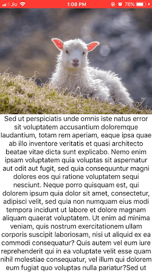

# StretchScrollView

An example app to create stretchable header for UIScrollview. Find the [Medium article](https://medium.com/@Anantha1992/stretchable-header-view-in-scrollview-swift-5-ios-7c4bb689ac49?source=friends_link&sk=375fa4a650321445d897a6fb41170294)

